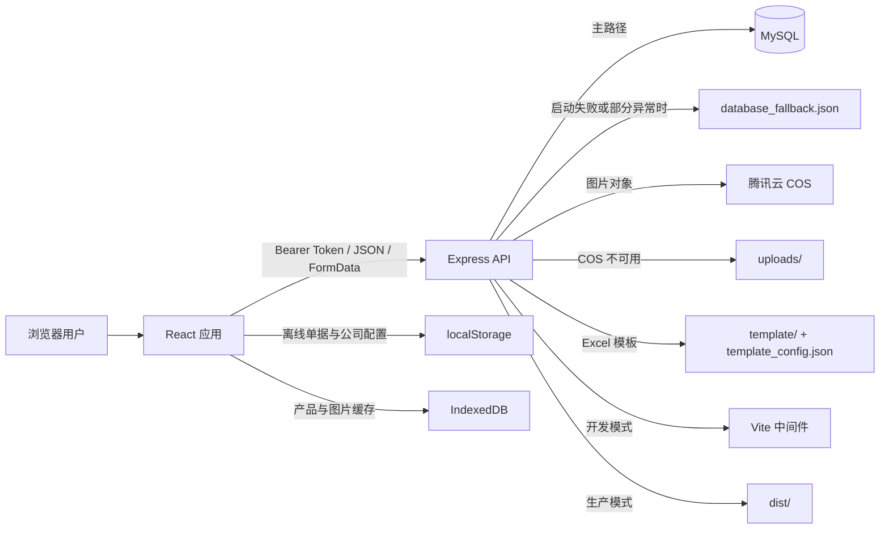
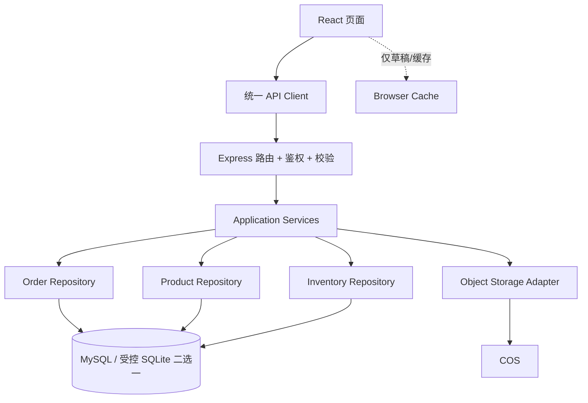
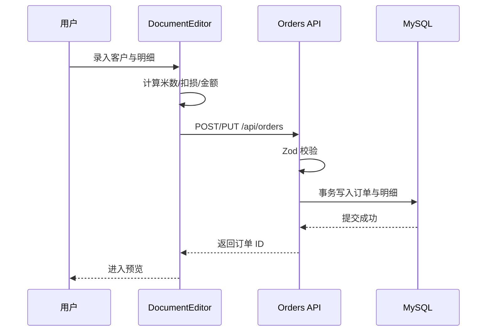

---
tags:
  - architecture
  - data-flow
updated: 2026-08-13
---

# 系统架构

## 当前架构图



## 数据源优先级（现状）

| 领域 | 首选 | 降级/缓存 | 风险 |
|---|---|---|---|
| 公司配置 | API → MySQL | 服务端 JSON；浏览器 localStorage | 保存失败可能只更新浏览器 |
| 单据 | API → MySQL | 服务端 JSON；浏览器 localStorage | 删除/备份存在状态分裂 |
| 库存 | API → MySQL | 服务端 JSON | 错误常被静默吞掉 |
| 产品 | API → MySQL | 服务端 JSON；浏览器 IndexedDB | 图片 ID 与缓存关联不稳定 |
| 图片 | COS | 本地 uploads；IndexedDB Base64 缓存 | 孤儿文件、内存和配额压力 |

## 核心问题：fallback 不是缓存，而是第二套实现

当前代码在很多路由中包含：

```text
如果 MySQL 可用 → 执行 MySQL 逻辑
否则           → 执行 JSON 文件逻辑
```

前端又在请求失败时使用 localStorage/IndexedDB。三层实现没有版本号、冲突解决、同步队列或明确的只读/只写规则，因此不能视为可靠的离线优先系统。

## 推荐目标架构



目标原则：

- 生产环境只有一个权威数据源。
- fallback 在启动时决定，不在单次请求失败时静默切换。
- 路由不直接写 SQL 或文件，由 service/repository 负责。
- 浏览器只保存草稿或可失效缓存，不冒充完整数据库。
- 文件与数据库变更用事务/补偿任务保证最终一致。

## 主要数据流

### 开单



### 产品图

当前路径同时写 IndexedDB、临时文件、COS 和数据库，顺序与失败补偿不完整。优化方案见 [[09-优化路线图#P1：正确性与一致性]]。
