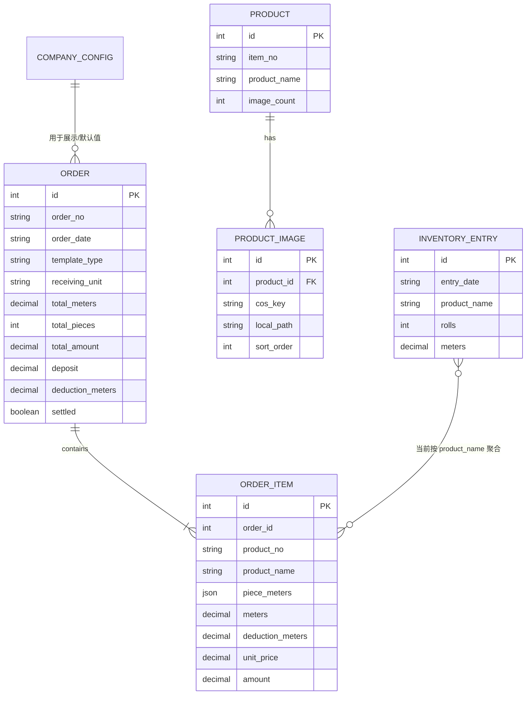

---
tags:
  - data-model
  - domain
updated: 2026-08-13
---

# 数据模型

## 实体关系

## 单据类型映射

| 前端枚举 | 后端值 | 中文 |
|---|---|---|
| `sample` | `sample` | 样布码单 |
| `sales` | `bulk` | 销售发货码单 |
| `deposit` | `deposit` | 定金单 |

前后端对销售类型使用不同字符串，映射集中在 `App.tsx`。建议统一契约或由共享 schema 生成类型。

## 定金字段歧义

> [!danger] 同一字段两种单位
> `DocumentData.deposit` 注释写“预收订金（元）”；销售单按金额扣减，定金单却按百分比计算。数据库同一列也承载两种语义。

推荐拆分：

| 新字段 | 单位 | 适用 |
|---|---|---|
| `deposit_rate` | 0–100 百分比 | 定金单 |
| `prepaid_amount` | 人民币元 | 销售/样布（如需要） |
| `amount_due` | 元，派生值 | 不建议直接持久化，按规则计算 |

迁移前必须先确认历史数据中每种单据的 `deposit` 实际含义。

## 分匹字段歧义

销售明细的 `rollNo` 实际保存一串数值，例如 `42.5 41.2`，后端存为 `piece_meters` JSON。它不是传统意义上的“匹号”。建议：

- 将现字段统一命名为 `pieceMeters: number[]`。
- 若需要真实匹号，新增 `pieceNo` 或结构化 `pieces: [{ no, meters }]`。
- 总匹数从 `pieces.length` 派生。

## 汇总字段

订单保存 `total_meters/total_pieces/total_amount/deduction_meters`，产品保存 `image_count`。这些都可从子记录派生，多路径手工维护会失配。

可选策略：

1. 读取时 SQL 聚合或使用视图；一致性最好。
2. 保留冗余字段，但所有变更必须在同一事务中更新，并加一致性测试。

## 日期字段

`orders.order_date` 与 `inventory_entries.entry_date` 当前是 `VARCHAR(50)`。建议迁移为 `DATE`，API 仍使用 `YYYY-MM-DD`。

## 约束建议

- `orders.order_no` 增加唯一约束。
- `order_items.order_id` 增加外键并启用级联删除。
- 产品建立稳定业务键；若货号允许重复，不可用货号执行批量删除。
- 库存关联产品 ID/货号，而不是只按品名文本。
- 金额统一 Decimal 口径，避免前端浮点误差扩大。
