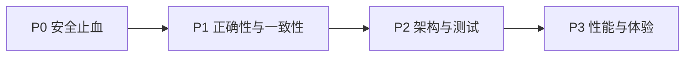

---
tags:
  - roadmap
  - optimization
updated: 2026-08-13
---

# 优化路线图

## 优先级总览



## P0：安全止血（当天）

- [ ] 轮换明文泄露的云凭证，删除敏感文件，检查历史传播（需管理员在云平台处理）。
- [x] 删除默认 `admin123` 回退；缺少 `ADMIN_PASSWORD` 时拒绝启动。
- [x] 对登录和 API 接入 `express-rate-limit`。
- [x] 禁止公开同源 SVG 上传。
- [x] `/uploads` 改为登录 Cookie 鉴权，并设置不可执行内容安全策略。
- [x] 完整修复图片代理 SSRF：IPv4/IPv6 私网、DNS 失败拒绝、重定向逐跳校验、响应大小/类型/超时限制。

验收标准见 [[10-安全基线]]。

## P1：正确性与一致性（1–2 个迭代）

- [x] 删除单据/产品时必须检查后端 `res.ok`，失败不改变权威 UI 状态。
- [ ] 将“浏览器备份”改名为本地快照，或实现真实服务端备份/恢复。
- [ ] 拆分 `depositRate` 与 `prepaidAmount`，迁移历史数据。
- [x] 修复移动端销售扣损金额重算。
- [x] 修复定金 Excel 使用 `deposit_terms`。
- [ ] 确认库存销售匹数口径，按结构化 pieces 计算。
- [ ] 服务端生成唯一单据号，并加数据库唯一约束与 409 冲突处理。
- [ ] 产品保存/删除/导入使用事务与文件补偿，禁止“文件已删、DB 未删”。
- [ ] 修复产品图片的服务端 ID ↔ IndexedDB 缓存 ID 映射。
- [ ] 请求级数据库故障不再静默切换到另一套存储。

## P2：架构与测试（2–4 个迭代）

### 后端拆分

```text
server/
├─ app.ts
├─ config/
├─ middleware/
│  ├─ auth.ts
│  ├─ rateLimit.ts
│  └─ errors.ts
├─ modules/
│  ├─ orders/
│  ├─ products/
│  ├─ inventory/
│  ├─ company/
│  └─ templates/
├─ repositories/
├─ storage/
└─ migrations/
```

### 前端拆分

```text
src/
├─ api/client.ts
├─ auth/
├─ features/orders/
├─ features/products/
├─ features/inventory/
├─ features/company/
├─ layouts/
└─ shared/
```

- [ ] 统一 API client、401、错误体与 toast。
- [ ] 用共享 zod schema 或生成式契约替代大量 `any`。
- [ ] 开启 TypeScript `strict`，分阶段修复。
- [ ] 引入版本化数据库 migration。
- [ ] 建立 repository 接口，删除路由中的 MySQL/JSON 分支。
- [ ] 建立 Vitest + Supertest + Playwright 测试层。
- [ ] 增加 CI：lint、test、build、secret scan、dependency audit。

## P3：性能与体验

- [ ] 订单和产品 API 分页、搜索、排序下推数据库。
- [ ] 图片改真实 URL + 缓存头 + 按需加载，不再 Base64 JSON 批量返回。
- [ ] Excel 单据直接返回二进制流。
- [ ] 将 `DocumentPreview` 的导出依赖进一步按操作动态加载。
- [ ] PNG 长图增加尺寸保护、分页/PDF 或服务端渲染。
- [ ] 大盘派生统计使用服务端聚合或 memoization，并先用 profiler 验证。
- [ ] 统一非阻塞通知、加载态、重试和撤销。
- [ ] 精简移动底栏，提升窄屏触控体验。
- [ ] Google Fonts 改自托管或可靠系统字体回退。

## 建议的第一批改动包

为了降低一次性重构风险，第一批只做可验证的安全与正确性修改：

1. 凭证轮换与敏感文件清理。
2. 禁止默认密码 + 登录限流。
3. 删除/保存接口严格检查响应。
4. 修复定金条款与移动端扣损。
5. 为上述行为补集成/E2E 测试。

完成后再开始 repository 与模块拆分。
