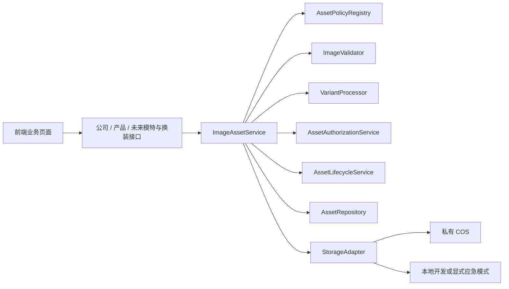

# Fabric DMS 统一图片资产系统设计

- 日期：2026-08-22
- 状态：设计已逐节确认，等待书面规范复核
- 方案：方案 A，在现有 Express 应用内建设边界清晰的图片资产模块

## 1. 背景与目标

Fabric DMS 当前存在多套互不一致的图片链路：公司 Logo 和二维码以 Base64 或历史 COS URL 保存，通用上传接口直接返回文件 URL，产品图片同时维护 COS key、本地路径、缩略图和前端 IndexedDB Base64 缓存。样布码单导出又需要浏览器重新读取这些图片，导致私有 COS、跨域、签名过期和匿名代理 403 等问题叠加。

本设计建立统一图片资产模块，使公司图片、产品花型图、未来模特照片和换装结果都使用同一套上传、校验、存储、读取、导出、引用和清理规则。

目标如下：

1. 生产环境以私有腾讯云 COS 为唯一权威文件存储。
2. 业务数据库只保存资产 ID 和 COS object key，不保存永久访问 URL 或新 Base64 图片。
3. 浏览器直传 COS 隔离区，服务端完成真实性校验、哈希去重和正式入库。
4. 原图在有效引用期间永久保留，并自动生成展示图和缩略图。
5. 普通页面高效直读签名 URL，Canvas 导出通过同源受控内容链路完成。
6. 通过显式业务关联、引用计数、30 天回收站和幂等清理避免误删或孤立文件。
7. 新旧链路渐进迁移，不删除尚未验证的历史字段和文件。

## 2. 范围与非目标

首期实施范围：

- 图片资产基础设施和数据库模型。
- COS 隔离上传、真实性校验、SHA-256 去重和 variants 生成。
- 私有图片鉴权读取、短期签名 URL 和同源导出读取。
- 公司 Logo、微信二维码、支付宝二维码接入。
- 样布码单预览与 PNG 导出修复。
- 产品图片上传、列表缩略图、详情展示图、原图下载和删除链路接入。
- 历史公司图片和产品图片的渐进迁移工具。

以下内容不进入首期：

- 完整模特库和换装产品功能，仅保留资产接口和目标数据关系。
- 花型循环尺寸、DPI、色彩空间、无缝属性和配色等专业字段的完整业务设计。这些字段预留扩展能力，但本期不强制填写。
- 独立媒体微服务、独立消息队列或 CDN 改造。
- 删除旧字段、历史 COS 文件或本地文件。

## 3. 总体架构

统一图片模块部署在现有 Express 服务中，业务控制器不再直接操作 COS SDK、本地文件、Base64 或远程 URL。



组件职责：

- `ImageAssetService`：统一编排上传完成、去重、关联、读取和状态变更。
- `AssetPolicyRegistry`：集中定义不同用途允许的格式、文件大小、像素和 variants。
- `ImageValidator`：使用 Sharp 检查真实内容、尺寸、像素、可解码性和实际 MIME。
- `VariantProcessor`：保存原图并生成 `display`、`thumbnail` 等版本。
- `AssetAuthorizationService`：根据公司、产品和未来业务关联判断访问权限。
- `AssetLifecycleService`：维护引用、回收、恢复、清理和一致性核对。
- `AssetRepository`：封装 MySQL 事务、行锁和查询。生产新资产写入要求 MySQL 可用；旧 JSON 数据仅保留兼容读取，不作为新资产权威元数据源。
- `StorageAdapter`：隔离 COS 与本地实现，暴露上传授权、读取、写入、复制、删除、存在性检查和签名访问接口。

生产环境不得在单次请求失败时自动从 COS 切换到本地，否则会形成两个权威存储。存储模式必须由部署配置显式选择；本地模式只用于开发或经人工确认的单节点应急运行。

尚未建立业务关联的资产只能由创建者在上传完成后的 24 小时绑定窗口内访问。窗口结束仍无引用时，资产自动进入回收站。资产建立业务关联后，访问权限只由有效业务关联决定，不能继续依赖 `created_by` 绕过业务权限。

## 4. 数据模型

### 4.1 `image_assets`

一条记录代表一份经过服务端验证的图片内容。

关键字段：

- `id`：不可猜测的 UUID。
- `sha256`：服务端按原始文件字节计算，建立唯一索引。
- `original_filename`、`detected_mime`、`detected_extension`。
- `byte_size`、`width`、`height`。
- `storage_provider`：`cos` 或 `local`。
- `status`：`quarantine`、`processing`、`ready`、`recycled`、`degraded`、`purged`。
- `ref_count`：有效业务关联数量的缓存值。
- `created_by`、`created_at`、`updated_at`。
- `recycled_at`、`purge_after`、`purged_at`。
- `metadata_json`：保留非核心扩展元数据；不得用来替代需要约束和查询的核心字段。

`sha256` 去重以实际上传内容为依据。客户端提供的哈希只能用于提前提示，不能直接获得其他业务资产。若用户无权访问已有相同哈希资产，仍须上传完整文件；服务端验证其确实持有相同内容后才允许复用该资产。

### 4.2 `image_asset_variants`

保存资产的物理文件版本：

- `asset_id`。
- `variant`：`original`、`display`、`thumbnail`。
- `object_key` 或本地相对路径。
- `mime`、`byte_size`、`width`、`height`。
- `created_at`。

`asset_id + variant` 建唯一约束。object key 使用内容寻址结构，例如：

```text
assets/sha256/ab/cd/<sha256>/original.<detected-extension>
assets/sha256/ab/cd/<sha256>/display.webp
assets/sha256/ab/cd/<sha256>/thumbnail.webp
```

原始文件不转码覆盖。Logo 和二维码默认生成 `original + display`；产品图默认生成全部三个版本。

### 4.3 上传和处理任务

`image_upload_sessions` 保存上传用途、隔离 object key、声明大小和类型、创建人、过期时间、状态及最终资产 ID。上传会话默认 24 小时过期。

`image_processing_jobs` 保存任务类型、资产 ID、状态、尝试次数、下次执行时间、锁定信息和最后一个结构化错误。第一阶段使用 MySQL 任务表和应用内 worker；接口边界允许未来替换成独立队列或媒体服务。

### 4.4 显式业务关联

不使用 `owner_type + owner_id` 通用关联表。

- `company_image_assets`：`company_id`、`role`、`asset_id`；`role` 支持 `brand_logo`、`wechat_qr`、`alipay_qr`，每个公司每种角色只有一个当前值。
- `product_image_assets`：`product_id`、`asset_id`、`role`、`sort_order`、`is_primary`、`deleted_at`。`role` 首期支持 `pattern_original`、`gallery`、`swatch`。

目标模型中还包括：

- `model_profiles` 与 `model_image_assets`：模特作为可复用业务实体，关联原始照片和参考照片。
- `tryon_results`：关联花型资产、模特、生成参数、模型版本、任务状态和结果资产。

后两组表属于未来业务目标关系，首期不创建完整业务功能。图片资产模块的 API 不依赖它们存在。

## 5. 上传、校验、去重与正式入库

### 5.1 申请上传

前端调用 `POST /api/image-assets/upload-sessions`，提交用途、文件名、声明 MIME 和大小。后端完成登录校验和用途策略检查后，创建只能写入指定隔离 key、限定大小并短期有效的上传授权。

生产前端直接上传到私有 COS 隔离前缀。开发本地适配器可返回同源上传端点，但保持相同 upload session 契约。前端不能指定正式 object key。

### 5.2 完成上传

前端上传成功后调用 `POST /api/image-assets/upload-sessions/:id/finalize`。该接口幂等：相同会话重复调用返回同一个结果，不重复创建资产或任务。

后端读取隔离对象并执行：

1. 检查实际字节数和上传会话约束。
2. 使用 Sharp 验证真实格式、像素、尺寸和可解码性。
3. 拒绝 MIME/扩展名/真实内容不一致、超限文件、像素炸弹和不支持的格式。
4. 在服务端计算 SHA-256。
5. 查找可复用资产。
6. 创建或恢复资产，并创建处理任务。

校验失败立即删除隔离对象并关闭会话。未完成会话和对应隔离对象在 24 小时后清理。

### 5.3 正式处理

worker 将原图复制或写入内容寻址正式路径，生成所需 variants，验证目标对象存在后将资产标记为 `ready`，最后删除隔离对象。业务模块只能关联 `ready` 资产。

COS 和 MySQL 无法形成跨系统事务，因此每一步必须幂等。数据库记录包含足够状态以继续或补偿：重复任务不得生成额外记录；数据库失败后的正式对象由一致性任务识别；部分 variants 失败时保留失败步骤并重试。

## 6. 图片读取、预览与导出

### 6.1 普通页面展示

产品列表和详情页通过资产 ID 批量申请访问描述。后端鉴权后返回对应 `thumbnail` 或 `display` 的短期 COS 签名 URL 和过期时间。

签名 URL 仅保存在运行时，不写入数据库或 IndexedDB。IndexedDB 可缓存资产 ID、版本号和浏览器自己的响应缓存信息，但不再保存整张 Base64 图片。签名过期后前端重新申请。

COS CORS 仅允许受信任站点来源执行所需的 `GET` 和 `HEAD`，Bucket 保持私有。

### 6.2 同源受控内容接口

导出和需要稳定同源读取的场景使用：

```text
GET /api/image-assets/:assetId/content?variant=display
```

后端先检查当前用户能否通过有效业务关联访问该资产，再使用 `StorageAdapter` 读取对象并流式返回真实 `Content-Type`、`Content-Length`、ETag 和私有缓存策略。该接口只读取已登记资产，不接受任意远程 URL，因此不能成为开放代理。

### 6.3 样布码单导出

导出前端执行以下固定流程：

1. 收集导出 DOM 中所有资产图片。
2. 通过同源内容接口带凭据获取 Blob。
3. 在克隆的导出 DOM 中将图片替换为 Blob URL。
4. 等待每张图片 `decode()` 成功。
5. 生成 PNG。
6. 在 `finally` 中释放全部 Blob URL。

这条链路不依赖浏览器匿名访问私有 COS，也不受短期签名过期和 Canvas 跨域污染影响。

### 6.4 历史图片读取

迁移期读取顺序：

1. 优先读取新资产关联。
2. 没有资产关联时读取旧字段。
3. 旧字段属于本项目 COS 域名时，解析 object key，并通过官方 COS SDK 和服务端凭据读取。
4. 旧本地相对路径通过受控本地适配器读取。
5. 旧 Base64 data URL 保持临时兼容。

禁止后端对用户提交的任意 URL 发起代理请求。历史 COS URL 解析必须校验 Bucket、Region、Host 和 key，HTTP 与 HTTPS 仅作为旧字符串格式差异处理，不能决定授权方式。

## 7. 关联、替换、回收与物理清理

所有关联变更由 `ImageAssetService` 在数据库事务中完成，业务代码不得直接修改 `ref_count`。

替换公司图片时，在同一事务中写入新关联、增加新资产引用、解除旧关联并减少旧资产引用。新资产未 `ready` 或事务失败时，旧图片继续生效。

`ref_count` 是快速判断缓存，显式业务关联才是事实来源。定时一致性任务按有效关联重新计算并修复引用数。

当引用数降为零：

- 资产转为 `recycled`。
- 设置 `purge_after = recycled_at + 30 days`。
- 30 天内保留原图和所有 variants。
- 重新关联或验证后的相同内容上传可将资产恢复为 `ready`。

清理 worker 在物理删除前对资产加锁，并再次确认状态、引用数和 `purge_after`。删除所有 variants 成功后才标记 `purged`；部分失败记录具体 variant 并重试。共享资产只要存在一个有效引用就不能回收。

周期性一致性检查处理：

- 数据库记录存在但对象缺失：标记 `degraded` 并告警。
- 正式前缀对象存在但数据库无记录：登记为孤立候选，经过观察期后再清理。
- 引用数与关联不一致：以关联为准修复。
- 上传会话过期：清理隔离对象，不进入业务回收站。

## 8. API 契约与错误处理

首期资产 API：

- `POST /api/image-assets/upload-sessions`
- `POST /api/image-assets/upload-sessions/:id/finalize`
- `GET /api/image-assets/:id`
- `POST /api/image-assets/access-urls`：批量申请普通展示签名地址。
- `GET /api/image-assets/:id/content?variant=...`：同源鉴权读取。

迁移期另保留受业务约束的兼容内容端点，例如 `GET /api/company/images/:role/content`。该端点在服务端解析“新资产关联优先、旧公司字段兜底”，使尚无 `asset_id` 的历史 Logo 和二维码也能参加同源导出。产品历史图片继续通过产品归属明确的业务端点读取。兼容端点不接收远程 URL 参数，并在对应业务完成迁移后再单独评估下线。

资产关联和解除通过公司、产品等业务接口完成，不开放可绕过业务权限的通用“任意关联”接口。

统一错误结构：

```json
{
  "error": {
    "code": "ASSET_PROCESSING_FAILED",
    "message": "图片处理失败",
    "requestId": "req_xxx",
    "retryable": true
  }
}
```

稳定错误码包括：

- `UPLOAD_SESSION_EXPIRED`
- `IMAGE_CONTENT_INVALID`
- `IMAGE_LIMIT_EXCEEDED`
- `ASSET_NOT_READY`
- `ASSET_ACCESS_DENIED`
- `ASSET_NOT_FOUND`
- `ASSET_PROCESSING_FAILED`
- `STORAGE_UNAVAILABLE`

前端只自动重试 `retryable: true` 的请求。响应不得暴露 COS 凭据、签名原文、内部异常堆栈或不必要的完整 object key。

## 9. 渐进迁移与发布顺序

### 阶段 1：基础设施和历史受控读取

上线资产表、上传会话、处理任务、StorageAdapter、鉴权内容接口、公司图片兼容内容端点、历史 COS URL 解析与 SDK 读取。该阶段不改变现有业务写入，但先移除导出链路对匿名远程代理的依赖。

### 阶段 2：公司图片和样布码单

新上传 Logo 和二维码进入资产系统。公司资料接口保持前端所需业务结构，内部优先读取新关联、旧字段兜底。样布码单切换到 Blob 导出流程。后台批量迁移旧 COS URL、本地文件和 Base64 图片。

### 阶段 3：产品图片

产品页面、Excel 导入和批量上传脚本统一调用资产服务。列表读取缩略图，详情读取展示图，下载读取原图。迁移保留图片顺序、主图关系和旧记录可追溯信息。

### 阶段 4：未来模特与换装

资产基础设施稳定后，单独设计和实现模特库、生成任务和换装结果，不纳入本次实现计划。

每个业务域有独立功能开关。回退方式是在包含新旧读取能力的新版本中关闭该域切换，不通过删除新表或回滚数据完成。数据库改动只新增，不覆盖和删除旧字段。

迁移工具必须支持：

- 只读盘点和 dry-run。
- 限定批次大小。
- 检查点和断点续跑。
- 按内容哈希幂等执行。
- 失败记录、重试和最终汇总。
- 迁移前后数量、引用和抽样内容校验。

旧字段和旧文件不属于本次删除范围。只有迁移数量与引用一致、抽样内容和导出结果正确、经过稳定观察期并再次获得用户明确批准后，才能单独设计清理任务。

## 10. 安全、可观测性与运维

安全要求：

- Bucket 保持私有，客户端只获得最小权限、短时有效的单对象上传或读取授权。
- 服务端不信任客户端 MIME、扩展名、尺寸或哈希。
- 首期只接受经过 Sharp 解码验证的受支持栅格图片，不接受 SVG 等可执行内容格式。
- 所有资产读取必须经过业务关联鉴权；知道资产 ID 或哈希不等于拥有访问权。
- 不提供任意 URL 代理，不允许路径穿越或客户端指定正式 key。
- 限制文件字节数、像素数、并发上传和处理任务重试次数。

结构化日志记录 `requestId`、`assetId`、`uploadSessionId`、`jobId`、处理阶段和稳定错误码，不记录 Cookie、密钥或完整签名 URL。

监控至少覆盖：

- 上传、校验、处理和迁移成功率。
- 各阶段耗时和任务重试次数。
- COS 403、404、超时和限流数量。
- 长时间停留在 `processing` 的资产数。
- 回收站、清理失败、孤立对象和 `degraded` 资产数。
- 引用数不一致数量。

## 11. 测试策略

单元测试：

- 资产状态机和用途策略。
- 服务端哈希去重和受权复用规则。
- COS URL 到 object key 的严格解析。
- 引用计数、回收和恢复。
- 业务关联权限判断。

集成测试：

- 隔离上传、真实内容校验和 variants 生成。
- finalize 重复调用和 worker 重复任务。
- 数据库失败、COS 部分成功时的补偿。
- 相同内容重复上传和共享资产删除。
- 30 天回收及物理清理。

安全测试：

- 伪造 MIME、扩展名不一致、超限文件和像素炸弹。
- SVG、非图片内容、路径穿越和任意 URL 代理尝试。
- 未授权 asset ID、过期上传授权和过期读取签名。

故障注入测试：

- COS 403、404、超时和限流。
- worker 在处理步骤间中断后恢复。
- 一个 variant 删除失败时不提前标记 `purged`。
- 引用计数漂移后的核对修复。

端到端测试：

- 上传公司 Logo 和二维码，保存后刷新仍能显示。
- 样布码单预览和 PNG 导出均包含 Logo、二维码。
- 历史私有 COS URL 可通过 SDK 读取，导出不再触发代理 403。
- 产品上传、列表缩略图、详情展示图、原图下载和删除完整闭环。

项目级验证继续执行 lint、build、现有安全测试、新增资产测试和 `git diff --check`。

## 12. 首期验收标准

首期必须同时满足：

1. 新 Logo、二维码在公司资料和码单预览中正确显示。
2. PNG 导出文件实际包含 Logo 和二维码，不发生 Canvas 跨域或图片准备失败。
3. 历史私有 COS URL 通过 SDK 正常读取，不再使用匿名代理请求。
4. 产品列表只加载缩略图，详情使用展示图，下载才读取原图。
5. 新链路不在数据库、业务 JSON 响应或 IndexedDB 中保存整张 Base64 图片。
6. 相同图片内容只存一套物理 variants；共享引用删除不会误删文件。
7. 无引用资产进入 30 天回收站，恢复和物理清理均可安全重试。
8. 未授权用户无法通过 asset ID、哈希或历史 URL 读取图片。
9. 迁移可 dry-run、分批、断点续跑，并提供可核对汇总。
10. 所有约定的项目验证通过，且提交不包含个人配置、IDE 状态或无关文件。

## 13. 已确认的关键决策

- 采用方案 A：现有 Express 内的独立图片资产模块。
- 生产唯一权威文件存储为私有 COS。
- 普通展示使用短期签名 URL，导出使用同源受控内容接口。
- 客户端直传隔离区，服务端验收后转正。
- 原图保留，自动生成展示图和缩略图。
- SHA-256 内容去重，显式业务关联和引用计数。
- 软删除后保留 30 天，再由后台任务物理清理。
- 旧数据渐进迁移，新优先、旧兜底，不在本次删除旧数据。
- 模特与换装保留目标边界，后续单独设计实现。
- 花型专业元数据暂不深入，后续产品设计成熟后再补充。
