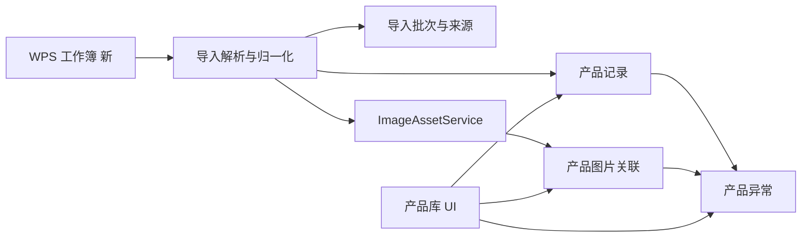

# Fabric DMS 产品四类图片与 WPS 产品库导入设计

- 日期：2026-09-20
- 状态：设计已逐节确认，等待书面规范最终审核
- 方案：统一产品图片关联模型，扩展现有统一图片资产系统
- 数据源：`D:\download\歌朗花型.xlsm` 的“新”工作表
- 关联设计：`docs/superpowers/specs/2026-08-22-unified-image-asset-system-design.md`

## 1. 背景与目标

当前产品库支持产品字段和多张花型图片，但图片没有完整的业务分类，缩略图、编辑弹窗、Excel 导入和图片资产关联也未共享一套分类契约。现有 WPS 工作簿尚未导入，产品库目前为空，适合在首次正式导入前一次完成图片模型升级。

本设计达成以下目标：

1. 每条产品记录统一管理花型原图、面料展示图、细节图和 AI 效果图。
2. 每类图片均支持上传、预览、替换、删除、排序和跨分类移动。
3. 每条产品可维护多个花型分类标签，并可通过关键词和标签组合搜索筛选。
4. 允许有问题的 Excel 数据先导入，产品立即可见和可使用，同时以结构化异常引导人工修正。
5. 从 WPS `DISPIMG` 公式中正确提取嵌入图片，不修改源工作簿。
6. 导入过程可 dry-run、幂等续跑、逐产品事务、追溯和有条件回滚。
7. 保持现有图片资产安全、去重、变体、引用计数和回收规则。
8. 首版只管理已有 AI 效果图，不接入 AI 生图服务，但预留生成元数据。

## 2. 已确认的业务规则

### 2.1 图片分类和数量

产品图片角色固定为：

- `pattern_original`：花型原图，最多一张，同时是产品主图。
- `fabric_display`：面料展示图，可多张并排序。
- `detail`：细节图，可多张并排序。
- `ai_effect`：AI 效果图，可多张并排序。
- `unclassified`：待分类，仅用于历史迁移和异常处理，不是正式销售分类。

每个产品的有效图片总数最多 20 张。展示图、细节图和 AI 效果图不设置独立数量上限，共享剩余名额。达到总上限后，所有上传入口禁用并显示明确提示。

### 2.2 产品可用性和审核状态

- 异常产品导入后立即出现在产品库中。
- 异常产品可以搜索、加入订单、浏览和用于展示。
- 存在未关闭异常时显示橙色“待完善”及未处理数量。
- 没有未关闭异常时自动显示“已审核”。
- 审核状态由异常事实计算，不设置容易失真的人工整单状态字段。
- 每个异常可以通过实际修正自动解决，也可以由用户选择“忽略并确认”。

### 2.3 重复货号

- 字段完全相同的重复记录合并为一个产品，并合并来源行和图片。
- 相同货号但品名、成分、克重或门幅不同的记录分别导入。
- 冲突记录全部显示“货号重复”和“产品数据冲突”异常。
- 人工处理支持修改货号、合并产品或确认允许重复。
- 未经人工决策，不自动覆盖、丢弃或猜测任何冲突记录。

### 2.4 花型分类标签

- 一个产品可关联 0 至 12 个花型分类标签；标签是产品业务属性，不是图片角色。
- 标签使用统一词表，用户在产品编辑弹窗中从已有标签选择，也可在具备产品编辑权限时直接创建新标签。
- 标签名称去除首尾空白后长度为 1 至 32 个字符；`normalized_name` 使用 Unicode NFKC、转小写和去除首尾空白生成，因此同名比较不区分大小写和全半角，界面保留首次创建的显示名称。
- 重命名标签会同步影响所有关联产品；已被产品使用的标签只能归档，不能直接物理删除。
- 产品库支持单个关键词搜索货号、品名、成分和标签名称，并支持多标签组合筛选。
- 多个选中标签默认使用“同时包含全部标签”的语义；关键词、标签、审核状态和异常条件之间使用 AND。
- 列表筛选由服务端执行后再分页，不能只过滤浏览器当前已加载的 50 条数据。
- 本次“新”工作表没有可靠的独立花型分类列，导入器不得从品名或 G 至 J 自由文本猜测标签；导入后的标签默认为空，由用户手动或批量补充。

## 3. 源工作簿实测结果

源文件约 133.3 MB，扩展名为 `.xlsm`，包内没有 VBA 工程。“新”是第二个工作表，范围为 `A1:N1239`，主要业务字段位于 A 至 F 列。

字段映射：

| Excel 列 | 表头 | 产品字段 |
| --- | --- | --- |
| A | Article No | 货号 `item_no` |
| B | Description | 品名 `product_name` |
| C | Composition | 成分 `composition` |
| D | Weight | 克重 `weight` |
| E | Width | 门幅 `width` |
| F | 花型 | 花型原图或花型文字说明 |

盘点结果：

- 有效源数据行：1,218。
- 唯一货号：1,151。
- 重复货号：57 组、124 行，其中 53 组的产品字段存在冲突。
- 缺品名 274 行、缺成分 280 行、缺克重 328 行、缺门幅 299 行。
- F 至 J 列共有 1,046 次 `DISPIMG` 引用，涉及 1,021 个唯一图片 ID。
- 14 条图片引用位于 G 至 I 列；其中 13 行已有 F 列图片，1 行只有附加列图片。
- 18 行 F 列是花型文字说明而不是图片公式。
- 93 行在 G 至 J 列含未映射价格、颜色、备注或附加图片。
- 两个图片引用没有实际图片数据：`新!F104 / G0059-1`、`新!F359 / G0196-2`。
- 两张图片超过 4,000 万像素限制；两张源媒体识别为 MPO。
- WPS 图片存储在 `xl/cellimages.xml`、对应关系文件和 `xl/media` 中。ExcelJS 在“新”工作表的 `getImages()` 返回 0，现有普通图片导入方式无法读取这些图片。

当前网页导入不能直接使用该文件：界面和服务端只接受 `.xlsx`，通用上传上限为 10 MB，且旧导入器固定读取第一个工作表“旧”。本设计使用专项迁移命令，不扩大普通网页上传权限。

## 4. 总体架构

本功能扩展现有统一图片资产系统，不建立四套图片表，也不把图片数组写入产品 JSON 字段。



组件边界：

- 产品服务负责产品字段、图片角色约束、分类排序和异常重算。
- 图片资产服务继续负责图片校验、去重、variants、鉴权、引用和回收。
- 导入解析器只读取源文件并生成规范化导入计划，不直接写数据库。
- 导入应用器按规范化计划调用产品服务和图片资产服务。
- 异常服务拥有异常的创建、自动解决、忽略、重开和审核状态计算。
- 前端只消费稳定角色、描述符和异常契约，不解析 WPS 文件或内部对象路径。

## 5. 数据模型

### 5.1 `product_image_assets`

沿用现有产品图片关联表，角色集合调整为本设计的五种角色。关键字段：

- `product_id`
- `asset_id`
- `role`
- `sort_order`：分类内从 0 开始连续排序。
- `is_primary`：仅花型原图为真。
- `origin_type`：`upload`、`excel_import`、`ai_generated`。
- `origin_metadata`：可选 JSON，保存导入单元格或未来 AI 模型、生成时间和提示词摘要。
- `deleted_at`

核心角色、顺序和主图字段必须是可查询、可约束列，不能只放在 JSON 中。`origin_metadata` 仅保存非核心扩展信息，不保存凭据、完整提示词中的敏感数据或内部存储路径。

服务层在事务内强制以下不变量：

- 每个产品最多一个有效 `pattern_original`。
- 每个产品最多 20 个有效图片关联。
- 有效图片的分类内 `sort_order` 连续且唯一。
- `is_primary = 1` 只允许出现在 `pattern_original`。
- 只能关联状态为 `ready` 且当前用户有权使用的资产。

### 5.2 `product_import_batches`

一条记录代表一次源文件和工作表导入：

- `id`
- `file_name`
- `file_sha256`
- `sheet_name`
- `status`：`planning`、`applying`、`completed`、`partial`、`failed`、`rolled_back`
- 各类统计数量和结构化汇总
- `started_at`、`completed_at`、`created_by`

dry-run 只生成本地审查报告，不创建批次记录或其他业务数据。正式 apply 才创建批次记录。`file_sha256 + sheet_name` 用于识别同一来源，但允许显式继续未完成批次。重复 apply 默认继续已有批次，不创建第二套产品。

### 5.3 `product_import_sources`

保存产品与源记录的多对多追溯关系：

- `product_id`
- `batch_id`
- `source_sheet`
- `source_row`
- `source_item_no`
- `source_payload`：A 至 J 原始值的受限 JSON 副本
- `source_fingerprint`

建立 `batch_id + source_sheet + source_row` 唯一约束。完全重复行合并为一个产品时，多条来源行都关联到该产品。

### 5.4 `product_issues`

- `id`
- `product_id`
- `product_image_asset_id`，图片问题可选关联
- `code`
- `severity`：`info`、`warning`、`error`
- `field_name`
- `message`
- `source_ref`
- `status`：`open`、`resolved`、`ignored`
- `resolution_note`
- `resolved_by`、`resolved_at`
- `created_at`、`updated_at`

产品的 `reviewStatus` 和 `openIssueCount` 由未关闭异常聚合产生。列表查询使用批量聚合，不逐产品执行查询。

### 5.5 `pattern_tags` 和 `product_pattern_tags`

`pattern_tags` 是统一标签词表：

- `id`
- `name`：用户看到的标签名称。
- `normalized_name`：用于唯一性比较的规范化名称。
- `status`：`active`、`archived`。
- `created_by`、`created_at`、`updated_at`

`product_pattern_tags` 保存产品和标签的多对多关联：

- `product_id`
- `tag_id`
- `created_by`、`created_at`

建立 `pattern_tags.normalized_name` 唯一约束、`product_id + tag_id` 联合主键，以及按 `tag_id + product_id` 的反向筛选索引。服务层在事务内限制单个产品最多 12 个标签。归档标签保留现有关联和历史展示，但不出现在新建关联的默认候选中。

本地 IndexedDB 缓存只保存产品返回的标签摘要 `patternTags: [{ id, name }]`，不作为标签词表权威来源。

### 5.6 兼容存储

生产托管资产继续以 MySQL 和私有 COS 为权威。旧 `product_images` 和本地 JSON 回退记录增加相同的 `role`、`sort_order`、`is_primary` 和来源字段，使业务契约在功能开关关闭时保持一致，但它们不替代生产图片资产权威存储。

专项导入应用器通过存储适配边界运行：

- 托管模式调用图片资产服务并写入 `product_image_assets`。
- 明确启用的单机兼容模式写入受控本地文件和带角色的旧图片记录。
- 模式在批次开始时固定；处理中不得静默切换存储后端。

## 6. 产品和图片 API

### 6.1 产品读写

- `GET /api/products`
  - 支持分页、关键词 `q`、`tagIds`、`tagMode=all`、`reviewStatus`、异常代码、导入批次和重复货号筛选。
  - 返回花型缩略图、分类数量、`patternTags`、审核状态和异常数量。
- `GET /api/products/:id`
  - 返回产品字段、全部分类图片、来源摘要和未关闭异常。
- `POST /api/products`
  - 接收产品字段、`patternTagIds` 和 `images: [{ assetId, role, sortOrder }]`。
- `PUT /api/products/:id`
  - 修改产品字段和完整 `patternTagIds` 集合，并在同一事务后重新计算相关异常。

标签词表接口：

- `GET /api/product-pattern-tags?status=active&q=`：搜索可选标签，同时允许按归档状态查询。
- `POST /api/product-pattern-tags`：创建标签；规范化后重名返回现有标签，不创建重复记录。
- `PATCH /api/product-pattern-tags/:id`：重命名或归档标签。
- `POST /api/products/batch-pattern-tags`：对选中产品批量增加或移除标签；单个产品超过 12 个标签时拒绝整批操作并返回受影响产品。

### 6.2 图片操作

- `POST /api/products/:id/images`
  - 向指定分类增加一张或多张已就绪资产。
- `PATCH /api/products/:id/image-layout`
  - 提交当前有效图片完整布局，用于分类内排序和跨分类移动。
  - 请求中的资产集合必须与服务端当前有效集合完全相同；该接口不能新增或删除图片。
- `DELETE /api/products/:id/images/:assetId`
  - 解除图片关联。删除花型原图后产生缺少花型原图异常。

所有写操作返回稳定错误结构和 request ID。违反单主图、总数、资产状态或访问权限时拒绝整个事务，不接受部分布局。

### 6.3 异常操作

- `POST /api/products/:id/issues/:issueId/ignore`
- `POST /api/products/:id/issues/:issueId/reopen`

字段补齐、图片分类完成、花型原图恢复等事实性问题由服务自动解决。需要业务判断的问题只能人工忽略或通过合并、修改货号等操作解决。

## 7. 异常规则

稳定异常代码及解决条件：

| 代码 | 产生条件 | 解决条件 |
| --- | --- | --- |
| `MISSING_PRODUCT_NAME` | 品名为空 | 品名非空 |
| `MISSING_COMPOSITION` | 成分为空 | 成分非空 |
| `MISSING_WEIGHT` | 克重为空 | 克重非空 |
| `MISSING_WIDTH` | 门幅为空 | 门幅非空 |
| `DUPLICATE_ITEM_NO` | 存在其他有效同货号产品 | 修改、合并或人工确认 |
| `CONFLICTING_PRODUCT_DATA` | 同货号产品字段不同 | 人工处理或确认 |
| `MISSING_PATTERN_ORIGINAL` | 无有效花型原图 | 增加花型原图 |
| `IMAGE_UNCLASSIFIED` | 有待分类图片 | 移入正式分类 |
| `IMAGE_REFERENCE_MISSING` | 源图片 ID 无媒体关系 | 补图或人工确认 |
| `IMAGE_FORMAT_CONVERTED` | 导入时执行格式转换 | 人工确认转换结果 |
| `IMAGE_RESIZED` | 导入时生成合规尺寸副本 | 人工确认缩放结果 |
| `IMAGE_LIMIT_EXCEEDED` | 源图片超过产品上限 | 删除、重新分配或人工确认未导入项 |
| `UNMAPPED_SOURCE_DATA` | 存在未映射 G 至 J 数据 | 人工录入或忽略 |

异常创建和重算必须幂等。同一产品、异常代码、字段和来源位置只保留一个当前问题，不在每次保存时重复创建。

## 8. WPS 专项导入

### 8.1 命令

```text
npm run import:products -- --file "D:\download\歌朗花型.xlsm" --sheet "新" --dry-run
npm run import:products -- --file "D:\download\歌朗花型.xlsm" --sheet "新" --apply
```

网页上传不承担该大文件和 WPS 专用图片格式的导入职责。

### 8.2 预检和解析

导入器：

1. 计算源文件 SHA-256。
2. 验证指定工作表和 A 至 F 表头。
3. 读取 A 至 J 原始值，并保留行号。
4. 从公式中解析 `DISPIMG` ID。
5. 解析 `xl/cellimages.xml`、关系文件和 `xl/media`，建立 ID 到图片字节映射。
6. 验证真实图片格式、大小、像素和可解码性。
7. 生成规范化产品、图片、来源和异常计划。
8. 输出 dry-run 汇总和逐行结果，不写业务数据。

### 8.3 归一化规则

- A 至 E 按原始文本去除首尾空白，不擅自改写货号或单位。
- 货号、品名、成分、克重和门幅在去除首尾空白后完全相同的重复行合并；字段冲突的同货号行分别保留。合并只合并产品记录，所有来源行和有效图片继续保留。
- 当前工作表没有可靠标签列，规范化产品的 `patternTagIds` 为空；导入器不得从其他字段推断花型分类。
- F 列第一张有效图片为 `pattern_original`。
- G 至 I 的附加图片为 `unclassified`。
- F 列只有文字时保留在来源数据，并产生缺少花型原图和未映射来源数据异常。
- 不能解析的图片产生异常，但产品和其他图片继续进入计划。
- MPO 转为标准 JPEG；超过 4,000 万像素的图片等比缩放到合规副本。
- 转换和缩放不覆盖源工作簿或源媒体；目标资产记录转换事实和原始尺寸。
- 超过 20 张的图片不关联产品，保留来源位置并产生超限异常。

### 8.4 应用和幂等

- 每个产品使用独立事务创建产品、图片关联、来源和异常。
- 单个产品失败时回滚该产品并继续后续产品。
- 图片内容按服务端 SHA-256 去重。
- 来源行唯一键和批次检查点防止断点续跑产生重复产品。
- 重新执行同一批次时，已完成行返回“已处理”，失败行可以重试。
- 批次结束状态为 `completed` 或 `partial`，不得把部分成功报告为完整成功。

### 8.5 回滚

正式 apply 前必须创建数据库或 JSON 快照。批次回滚只允许删除该批次创建且尚未被人工修改、未被订单引用的产品。若任何产品不满足条件，则拒绝自动整批回滚并输出阻塞清单。禁止使用强制删除绕过业务引用。

## 9. 产品库界面

### 9.1 列表

列表保持高密度表格，显示：

- 花型原图缩略图。
- 货号、品名、成分、克重、门幅。
- 花型分类标签；超过三个时折叠为“+N”。
- 展示图、细节图和 AI 效果图数量。
- “已审核”或“待完善 N 项”。
- 导入批次、工作表和来源行摘要。

筛选包括关键词、花型分类标签、审核状态、异常代码、图片完整性、导入批次和重复货号。标签选择器支持搜索已有标签，多个标签默认匹配“全部包含”，并显示当前匹配数量。列表不使用其他分类图片冒充花型原图。

### 9.2 图片查看器

- 点击列表花型缩略图打开查看器。
- 顶部显示货号和品名。
- 使用花型原图、面料展示图、细节图、AI 效果图四个标签。
- 分类内部支持左右切换、键盘方向键、关闭键和移动端滑动。
- 默认打开被点击图片。
- 缺少花型原图时显示占位状态和异常提示。
- 查看器只浏览，不提供删除和编辑按钮。

### 9.3 产品编辑弹窗

桌面使用双栏大弹窗，移动端改为单栏：

- 左侧编辑产品字段、显示来源和异常。
- 左侧使用可搜索多选框编辑花型分类标签，可选择已有标签或新建标签；达到 12 个时禁用继续添加。
- 右侧按待分类、花型原图、面料展示图、细节图、AI 效果图组织图片。
- 每个正式分类都有独立上传入口。
- 花型原图支持上传、替换、预览和删除。
- 其他分类支持批量上传、排序、预览、替换、删除和移动分类。
- 待分类区域仅在存在图片时显示，并使用橙色边框。
- 跨分类移动同时支持拖动和“移动到”菜单。
- AI 效果图显示来源标签，首版不显示生成按钮。

新文件先成为待保存资产。保存时在同一业务操作中提交产品字段、完整标签集合和图片关联布局；失败时弹窗保持打开。取消后未关联资产由现有生命周期规则回收。

列表批量操作增加“添加标签”和“移除标签”。批量操作只提交标签差异，不覆盖每个产品已有的其他标签。

## 10. 旧数据迁移和兼容

- 现有 `pattern_original` 保持不变。
- 旧 `gallery` 和 `swatch` 统一迁移为 `unclassified`，不猜测正式分类。
- 旧 `product_images` 第一张设为花型原图，其余设为待分类。
- 新读取优先使用资产关联，没有关联时继续读取旧图片记录。
- 数据库迁移只增加表、列和索引，不删除旧字段、旧记录或源文件。
- 完成分类、读取、导入和稳定观察之前，不执行旧图片清理。

## 11. 安全、性能和错误处理

- 沿用统一图片资产的真实内容校验、格式限制、10 MB 单图限制和 4,000 万像素限制。
- 不接受客户端指定 COS key、服务器路径或任意远程 URL。
- API 不返回原始 COS key、本地路径、凭据或完整签名日志。
- 图片读取继续按产品关联鉴权。
- 导入日志只记录批次、行号、产品 ID、资产 ID、阶段和稳定错误码。
- 列表按 50 条分页，图片描述符批量读取和签名，异常数量批量聚合。
- 关键词和标签筛选使用数据库索引和集合查询；产品、图片数量、异常数量和标签摘要批量加载，禁止逐产品查询标签。
- 导入器按产品和图片流式处理，不把 133 MB 文件内全部图片同时解码到内存。
- 单个图片处理失败不阻塞产品元数据和其他有效图片，但必须产生可见异常。

## 12. 实施和发布顺序

1. 增加角色、标签、来源、导入批次、来源追溯和异常表结构。
2. 实现后端不变量、图片布局、标签词表、异常重算和服务端筛选接口。
3. 更新前端类型、产品列表、查看器和编辑弹窗。
4. 实现 WPS dry-run 解析器和小型合成测试夹具。
5. 在测试数据库验证真实工作簿 dry-run。
6. 实现 apply、断点续跑、统计和受限回滚。
7. 完成一轮完整验收。
8. 验收通过且代码未再变化时直接提交推送，不在提交前重复验收。

每个阶段保持旧读取兼容。托管资产或本地兼容模式必须在进程启动时显式确定，不得在导入过程中自动切换。

## 13. 测试和验收

### 13.1 自动测试

后端单元和集成测试覆盖：

- 单花型原图、20 张总数和连续排序约束。
- 上传、关联、分类移动、排序、删除和共享资产安全。
- 图片布局集合一致性和事务回滚。
- 异常创建、自动解决、忽略、重开和审核状态聚合。
- 标签名称规范化、重名复用、12 个上限、重命名、归档和批量增减。
- 关键词搜索、多标签“全部包含”和其他筛选条件组合后的服务端分页结果。
- 重复货号识别、完全重复合并和冲突记录保留。
- dry-run 零写入。
- apply 幂等、断点续跑、逐产品回滚和批次统计。
- `DISPIMG`、缺失关系、MPO、超像素、附加图片和未映射字段夹具。
- 未授权读取、路径穿越、任意 URL、伪造格式和敏感日志防护。

前端测试覆盖：

- 缩略图点击打开正确产品和图片序号。
- 四个分类的上传、替换、删除、排序和移动。
- 分类标签数量、空状态和 20 张上限。
- 待完善标记、异常筛选、字段定位和自动关闭反馈。
- 标签新建、选择、移除、列表折叠展示、搜索筛选和批量增减。
- 桌面与移动端的关键操作路径。

### 13.2 真实数据验收

使用测试数据库和源文件“新”工作表：

1. dry-run 对 1,218 个源数据行给出明确处理结果。
2. 完全重复记录按规则合并，冲突货号分别保留并标记。
3. 所有可恢复 WPS 图片映射到正确来源行。
4. 两个缺失媒体引用生成异常但不阻塞产品。
5. MPO、超像素、附加图片和未映射数据均有明确记录。
6. 第二次 apply 不增加重复产品、来源或图片关联。
7. 随机抽查产品字段、图片内容、分类、行号和异常与 Excel 一致。
8. 产品列表可分页浏览，并按关键词、花型分类标签和异常组合筛选后进入订单流程。

### 13.3 项目级验收

开发完成后只执行一轮完整验收：

- TypeScript 类型检查。
- 完整单元和集成测试。
- 生产构建。
- 安全和图片资产冒烟测试。
- `git diff --check`。
- 真实工作簿 dry-run。
- 备份后在空产品库执行正式导入并核对批次统计。

验收通过后，如果代码未再变化，直接提交推送，不重复测试；若之后修改代码，只补测受影响范围并更新验收结论。

## 14. 非目标

- 首版不在产品库中调用 AI 模型生成效果图。
- 首版不自动判断展示图、细节图或 AI 效果图的视觉类别。
- 首版不把 G 至 J 的自由文本自动映射为价格或新产品字段。
- 本次不删除旧图片记录、旧 COS 文件、本地文件或源工作簿。
- 本次不重构订单产品快照、报价或画册生成业务，只提供可复用的分类图片数据。

## 15. 最终验收标准

功能完成必须同时满足：

1. 产品列表始终以花型原图作为主缩略图，点击可查看原图和四类图片。
2. 每类图片都能上传和编辑，分类、排序、替换和删除行为正确。
3. 单花型原图和 20 张总数约束在前后端一致执行。
4. 产品可维护多个花型分类标签，关键词、多标签和其他条件组合筛选覆盖全部分页数据。
5. 异常产品可立即使用，并能按异常筛选、逐项修正和自动完成审核。
6. 重复货号不被静默覆盖，完全重复和冲突记录按已确认规则处理。
7. 源工作簿不被修改，所有导入产品可以追溯到批次、工作表和行号。
8. WPS 单元格图片、转换、缩放、缺失媒体和附加图片均得到确定性处理。
9. dry-run、apply、断点续跑和重复执行结果可核对且幂等。
10. 生产图片资产安全、去重、鉴权、引用计数和回收规则不退化。
11. 一轮完整验收通过，最终提交不包含 `.firecrawl/`、个人配置或无关文件。

## 16. 已确认的关键决策

- 采用方案 A：统一产品图片关联模型。
- 产品图片分为花型原图、面料展示图、细节图、AI 效果图和迁移期待分类。
- 花型原图固定一张；其他正式分类可多张；总数最多 20 张。
- 产品列表以花型原图为主图，查看器按四个正式分类浏览。
- 每类图片均具有完整上传和编辑能力。
- 产品支持多个花型分类标签，并支持关键词与多标签组合搜索筛选。
- 首版只管理已有 AI 效果图，后期再考虑接入生图能力。
- 异常记录允许先导入、立即使用，并显示待完善标记。
- 异常逐项解决，全部关闭后自动成为已审核。
- 完全重复记录合并；冲突货号分别导入并交由人工处理。
- WPS 大文件使用本地专项迁移器，不走普通网页上传。
- 开发结束做一轮完整验收；无后续代码变化时提交推送不重复测试。
